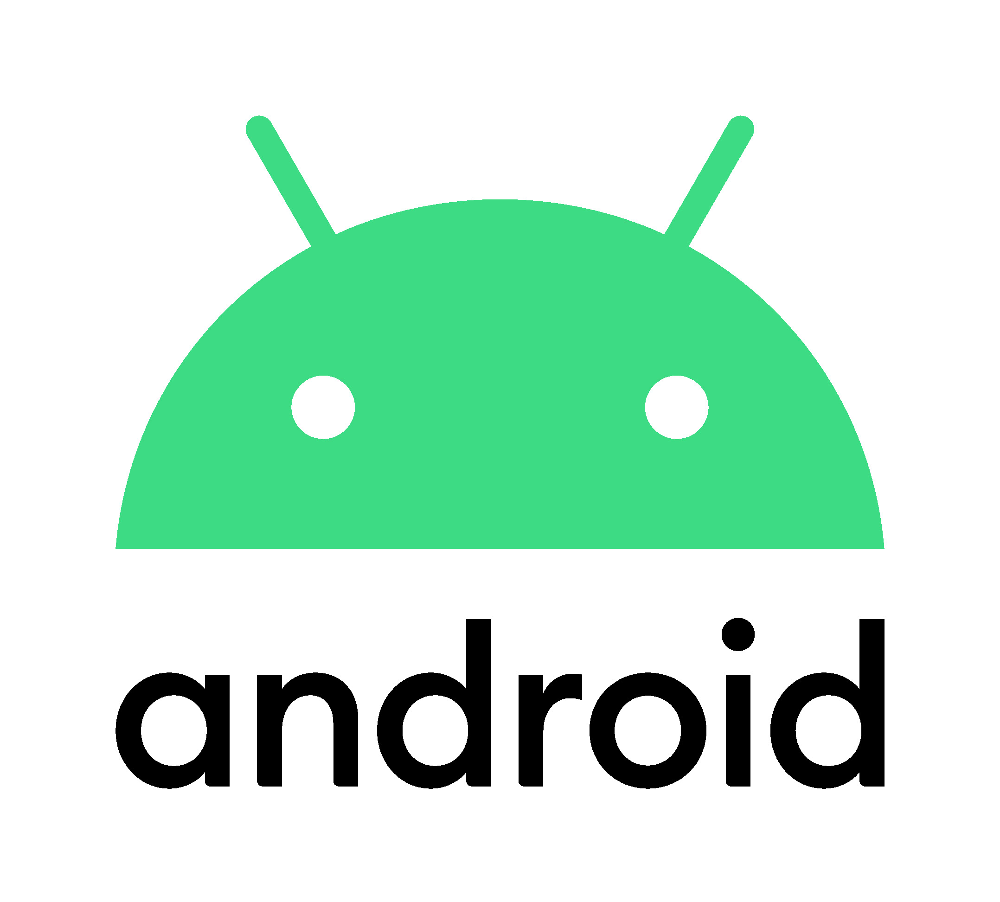

  

  
# **hey, I'm *tomawk* 👽**

I'm **Tommaso Giorgi**, a **MSc  Computer Engineering [Cybersecurity]** student at the University of Pisa.

### Coding Languages

### Technologies Used & Frameworks

 

<h2 align="center">

You can see all the project and more on my [Personal Website](https://tomawk.github.io)

</h2>

